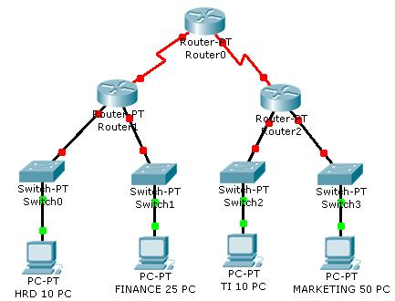

**Sistem Keamanan Jaringan**

  

1. Sebutkan layer yang ada pada OSI Layer
2. Sebutkan fungsi-fungsi layer dari OSI Layer asing-masing
3. Berikan contoh protocol dan perangkat pada OSI Layer
4. Sebutkan layer apa saja yang terdapat pada TCP/IP
5. Jelaskan fungsi setiap layer pada TCP/IP
6. Berikanlah contoh layer-layer pada TCP/IP
7. Jelaskan perbedaan antara OSI Layer dan TCP/IP Layer

Penjelasan

1. Ada tujuh layer pada OSI Layer diantaranya:

1. Application Layer
2. Presentation Layer
3. Session Layer
4. Transport Layer
5. Network Layer
6. Data Link Layer
7. Physical Layer

1. Fungsi OSI Layer masing-masing adalah

1. Application Layer berfungsi sebagai penyedia jasa untuk aplikasi pengguna dan bertanggung jawab atas pertukaran informasi.
2. Presentation Layer ini berfungsi sebagai data dikonfersi kemudian diformat untuk mengirimkan data.
3. Session Layer ini berfungsi menjaga terminal serta memelihara dan mengatur koneksi.
4. Transport Layer berfungsi memecahkan data ke dalam paket sehingga dapat disusun kembali pada tujuan yang telah diterima
5. Network Layer ini berfungsi untuk menjelaskan alamat-alamat IP
6. DataLink Layer ini berfungsi untuk menentukan bit-bit sehingga data dikelempokkan menjadi format dan disebut sebagai frame.
7. Physical Layer berfungsi untuk menjelaskan transmisi jaringan  serta metode pensinyalan.

1. Contoh protocol atau perangkat:

1. Application Layer : Http,ftp,DNS dan Mobile Phones
2. Presentation Layer : Remote Desktop Protocol (RDP)
3. Session Layer : Network File System (NFS)
4. Transport Layer : Connection Oriented (TCP)
5. Network Layer : Routing  dan Router
6. Data Link Layer : LLC,MAC dan Bridges
7. Physical Layer : IEE,ANSI dan Wireless

1. TCP/IP Layer

1. Appliacation Layer
2. Transport Layer
3. Internet Layer
4. Network Access

1. Fungsi Layer pada TCP/IP

1. Application Layer berfungsi sebagai pemberi service kepada pengguna jaringan atau terhadap software
2. Transport Layer berfungsi sebagai menggandakan komunikasi atau menggirimkan paket
3. Internert layer berfungsi untuk mencari jalur terbaik dalam penggiriman data
4. Network Access Layer berfungsi sebagai penggirim dan penerima data dari media fisik

1. Contoh Layer TCP/IP

1. Application Layer : HTTP dan FTP
2. Transport Layer : TCP dan UDP
3. Internet Layer : Protocol ICMP dan Protocol ARP
4. Network Access : Eternet pada LAN

1. Perbedaan antara OSI Layer dan TCP/IP adalaah  pada OSI sendiri adalah sebuah model jaringan yang dikembangkan untuk sebuah standranisasi sedangkan TCP/IP adalah model jaringan yag digunakan  untuk komunikasi dan untuk proses tukar menukar informasi.

Penutup

Kesimpulan

Kesimpulan diatas  dari penyataan bahwa setiap Layer memiliki fungsi yang berbeda serta memiliki contoh masing-masing baik pada OSI Layer dan TCP/IP.

Saran

Saran saya adalah lebih  mata kuliah keamanan jaringan ini lebih diperdalam lagi atau dikembangkan secara praktek agar lebih paham tentang jaringan dan sangat berperan penting dalam jurusan kami  yakni Teknik Informatika.