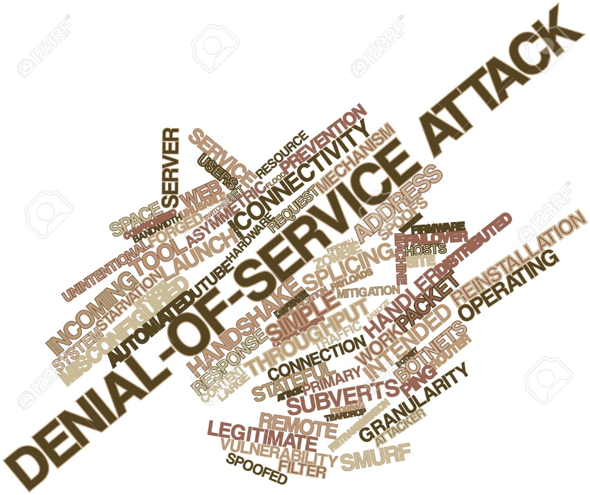
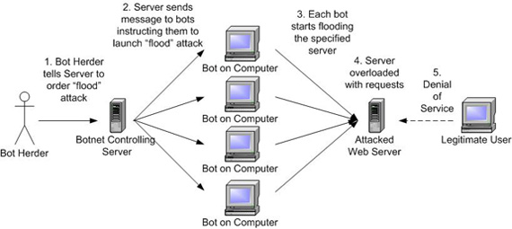

**Sistem Keamanan Jaringan**

**Denial Of Service**

 
  
  

Hacking akan melakukan cara terakhir jika sudah tidak ada cara terakhir untuk melakukan hacking yaitu cara terkhir yang dapat dilakukan yaitu Denial Of Service atau yang biasa disebut DOS, namun pada dasarya banyak cara yang dilakukan oleh hacker untuk merusak dan membuat system tidak berjalan baik dan benar.

**Rumusan Masalah**

1. Jelaskan yang dimaksud dengan DOS
2. Sebutkan jenis-jenis serangan DOS
3. Jelaskan bagaimana cara kerja DOS
4. Jelaskan bagaimana cara mencengah DOS

**Penjelasan**

1. Denial Of Service adalah jenis serangan yang tujuannya mencegah pengguna yang sesungguhnya menikmati layanan yang diberikan server dan  menghabiskan sumber yang dimiliki computer tersebut sehingga computer yang diserang tidak dapat menjalankan fungsinya dengan benar.
2. Jenis-jenis serangan DOS antara lain

1. Mematikan Server : one kill untuk membuat server menjadi crash
2. Menyibukkan Server : mengirim banyak request untuk membuat server sibuk

1. Gambar dibawah ini menjelaskan cara kerja DDoS. Attacker memberi perintah kepada semua pasukannya untuk membuat request HTTP ke sebuah website. Jika pasukan yang dikuasai attacker sangat besar, maka web server akan dibanjiri request sehingga menjadi terlalu sibuk dan tidak bisa diakses oleh pengguna yang sebenarnya (real visitor).

 
  

1. Cara mengatasi serangan DOS

1. Gunakan firewall agar kemungkinan para hacker tidak dapat melakukan sebuah serangan pada computer kita
2. Menolak semua paket data dan mematikan service UDP.

**Penutup**

Kesimpulan

Dari penjelasan diatas dapat disimpulkan bahwa Denial of service adalah serangan yang membuat server tidak bisa melayani pengguna yang sesungguhnya.

Saran

Ketikan Denial Of Service ini sudah di kuasai lakukankanlah ke hal yang baik dan benar jangan sampai ada pihak lain yang dirugikan .